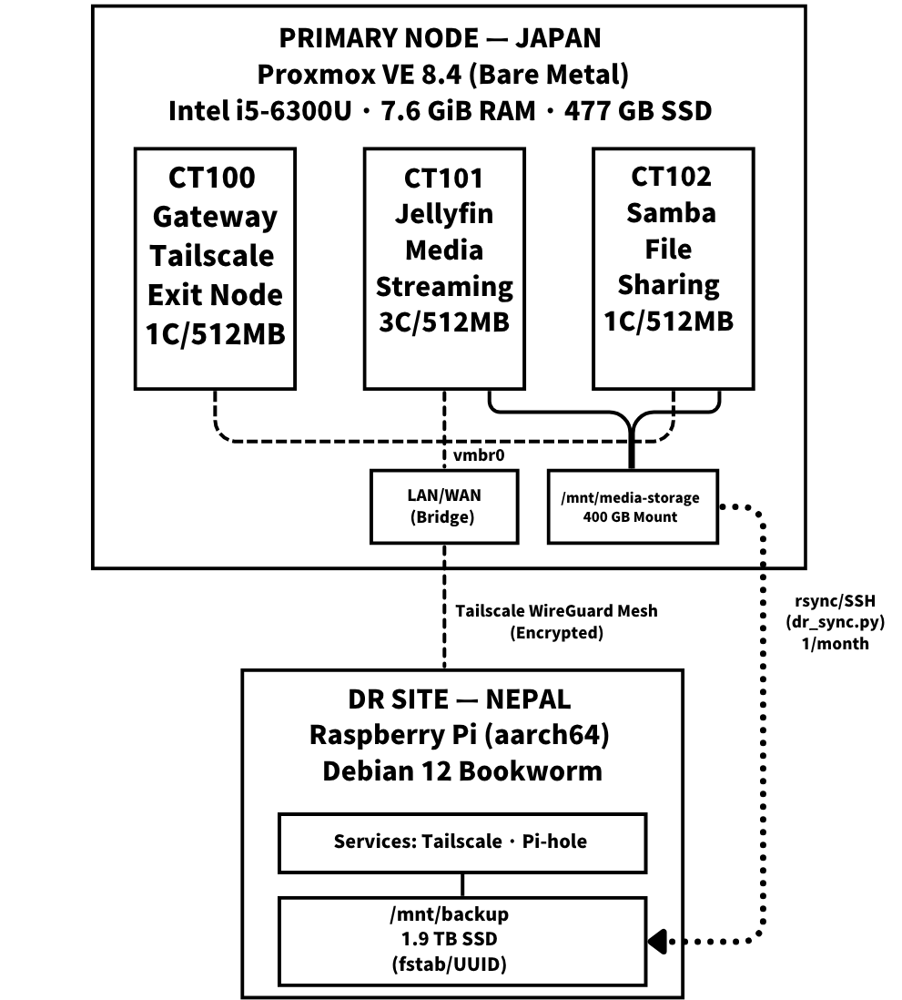

# Home Lab — Personal Infrastructure Platform

> A two-site infrastructure platform running on Proxmox VE with containerized services, automated offsite backup, and Tailscale mesh VPN connectivity. Running 24/7.

> Proxmox VE 上で稼働する 2 拠点インフラ基盤。コンテナ化されたサービス群、自動オフサイトバックアップ、Tailscale メッシュ VPN 接続。24 時間 365 日運用中。

---

## Table of Contents / 目次

- [Overview / 概要](#overview--概要)
- [Architecture / アーキテクチャ](#architecture--アーキテクチャ)
- [Current Status / 現在の状態](#current-status--現在の状態)
- [What I Built / 構築した内容](#what-i-built--構築した内容)
- [Repository Structure / リポジトリ構成](#repository-structure--リポジトリ構成)
- [Technologies / 使用技術](#technologies--使用技術)
- [Screenshots / スクリーンショット](#screenshots--スクリーンショット)
- [Documentation / ドキュメント](#documentation--ドキュメント)
- [Current Limitations / 現在の制約](#current-limitations--現在の制約)
- [Future Work / 今後の取り組み](#future-work--今後の取り組み)
- [Background / 背景](#background--背景)

---

## Overview / 概要

This repository documents the design, configuration, and operational tooling for my personal infrastructure platform — a system I operate continuously to practice Linux system administration and infrastructure engineering.

本リポジトリは、個人のインフラ基盤の設計・構成・運用ツールをまとめたものです。Linux システム管理とインフラエンジニアリングを実践する場として、継続的に運用しています。

The platform consists of two geographically separated nodes connected over a Tailscale WireGuard mesh:

この基盤は、Tailscale WireGuard メッシュで接続された 2 つのノードで構成されています：

| Site | Location | Role | Hardware |
|------|----------|------|----------|
| **Primary** | Japan 🇯🇵 | Proxmox VE hypervisor with LXC containers | Intel i5-6300U, 8 GB RAM, 477 GB SSD |
| **DR Site** | Nepal 🇳🇵 | Offsite backup & DNS filtering (Pi-hole) | Raspberry Pi (aarch64), 1.9 TB external SSD |

---

## Architecture / アーキテクチャ

<p align="center">
  
</p>

For a detailed breakdown of the Proxmox host, LXC container configurations, storage design, and networking, see [docs/architecture.md](docs/architecture.md).

Proxmox ホスト、LXC コンテナ構成、ストレージ設計、ネットワーキングの詳細は [docs/architecture.md](docs/architecture.md) を参照してください。

---

## Current Status / 現在の状態

| Item | Status |
|------|--------|
| Platform | **Running 24/7** |
| Primary site | Japan 🇯🇵 |
| DR site | Nepal 🇳🇵 |
| Last major update | July 2025 |

### Currently Hosting / 稼働中のサービス

| Service | Host | Description |
|---------|------|-------------|
| **Tailscale Exit Node** | CT100 (LXC) | VPN gateway with TUN/TAP passthrough in an unprivileged container |
| **Jellyfin** | CT101 (LXC) | Media streaming server with bind-mounted access to the shared storage pool |
| **Samba** | CT102 (LXC) | SMB file sharing for LAN devices (guest access for home use) |
| **Pi-hole** | Raspberry Pi (Nepal) | Network-wide DNS filtering, running directly on the Pi |

---

## What I Built / 構築した内容

This section describes the engineering work I personally did to build and operate this platform.

このセクションでは、この基盤を構築・運用するために自分で行ったエンジニアリング作業を記載します。

### Infrastructure Design / インフラ設計
- Designed the multi-site network topology connecting Japan and Nepal over Tailscale
- Selected and configured Proxmox VE as a Type-1 hypervisor on limited hardware (2C/4T, 8 GB RAM)
- Planned the LXC container fleet with per-service resource allocation (CPU cores, memory, disk)

  Tailscale で日本とネパールを接続するマルチサイトネットワークトポロジーの設計。限られたハードウェア（2C/4T、8 GB RAM）上で Proxmox VE を Type-1 ハイパーバイザーとして選定・構成。サービスごとのリソース割り当て（CPU コア、メモリ、ディスク）による LXC コンテナ群の計画。

### Container & Service Configuration / コンテナ・サービス構成
- Configured TUN/TAP device passthrough (`/dev/net/tun` bind mount + cgroup2 device allowlist) to run Tailscale inside an unprivileged LXC container — keeping the hypervisor off the VPN mesh
- Set up Jellyfin with bind-mounted media directories from the host's shared storage partition
- Configured Samba as a standalone file server with guest-accessible shares for home LAN devices
- All containers run unprivileged (UID remapping) as a baseline security practice

  非特権 LXC コンテナ内で Tailscale を実行するための TUN/TAP デバイスパススルー（`/dev/net/tun` バインドマウント + cgroup2 デバイスホワイトリスト）を構成。ホストの共有ストレージパーティションからのバインドマウントによる Jellyfin のセットアップ。ホーム LAN デバイス向けのゲストアクセス可能な共有を持つスタンドアロンファイルサーバーとして Samba を構成。すべてのコンテナをセキュリティのベースラインとして非特権（UID リマッピング）で実行。

### Storage & Backup / ストレージ・バックアップ
- Configured LVM Thin Provisioning for container root disks (on-demand allocation on a single SSD)
- Set up the 400 GB media storage partition with bind mounts into multiple containers
- Implemented offsite backup using `rsync` over SSH/Tailscale to the Nepal Raspberry Pi
- Configured the Nepal Pi's external SSD mount via `/etc/fstab` with UUID identification and `nofail` for boot-resilient headless operation
- Wrote the sync script ([`dr_sync.sh`](scripts/dr_sync.sh)) with bandwidth throttling, `PIPESTATUS` error detection, and structured logging

  コンテナルートディスク用の LVM シンプロビジョニング構成（単一 SSD 上のオンデマンド割り当て）。複数コンテナへのバインドマウントを伴う 400 GB メディアストレージパーティションのセットアップ。SSH/Tailscale 経由のネパール Raspberry Pi へのオフサイトバックアップの実装。ブート耐性のあるヘッドレス運用のための UUID 識別と `nofail` による外付け SSD マウント構成。帯域幅制限、`PIPESTATUS` エラー検出、構造化ログを備えた同期スクリプトの作成。

### Monitoring / 監視
- Built a health monitoring script ([`healthcheck.py`](scripts/healthcheck.py)) that uses `pct exec` to ping VPN nodes through the gateway container — allowing the Proxmox host to check remote node status without running Tailscale itself

  `pct exec` を使用してゲートウェイコンテナ経由で VPN ノードに ping を送信するヘルスモニタリングスクリプトの構築。Proxmox ホスト自体で Tailscale を実行せずにリモートノードの状態を確認可能。

---

## Repository Structure / リポジトリ構成

```
Home_Lab/
├── README.md
├── docs/
│   ├── architecture.md          # Host, containers, storage, networking
│   └── disaster-recovery.md     # Offsite backup, Tailscale routing, recovery
├── configs/
│   ├── proxmox/
│   │   ├── lxc-100-tailscale.conf
│   │   ├── lxc-101-jellyfin.conf
│   │   └── lxc-102-samba.conf
│   └── smb.conf
├── scripts/
│   ├── healthcheck.py
│   └── dr_sync.sh
└── images/
```

---

## Technologies / 使用技術

| Category | Technology |
|----------|-----------|
| Hypervisor | Proxmox VE 8.4 |
| Containerization | LXC (Unprivileged) |
| Storage | LVM Thin Provisioning, ext4 |
| Networking | Linux Bridge (`vmbr0`), Tailscale (WireGuard) |
| Media | Jellyfin |
| File Sharing | Samba |
| Backup | rsync over SSH/Tailscale |
| DNS | Pi-hole |
| Scheduling | cron |
| Monitoring | Python 3, `pct exec` |
| DR Node OS | Debian 12 (Bookworm) on Raspberry Pi |

---

## Screenshots / スクリーンショット

### Proxmox Dashboard

<p align="center">
  
</p>

### LXC Container List (`pct list`)

<p align="center">
  
</p>

### Tailscale Status (`tailscale status`)

<p align="center">
  
</p>

---

## Documentation / ドキュメント

Detailed technical documentation is available in both English and Japanese:

技術ドキュメントは日本語・英語の両方で提供しています。

| Document | Description |
|----------|-------------|
| [Architecture](docs/architecture.md) | Proxmox host design, LXC resource allocation, networking, and storage |
| [Disaster Recovery](docs/disaster-recovery.md) | Offsite backup strategy, Tailscale mesh routing, and recovery procedures |

---

## Current Limitations / 現在の制約

Being honest about what this platform does not yet have:

この基盤がまだ持っていないものについて正直に記載します：

- **Single Proxmox node** — No high availability or clustering. A hardware failure means downtime until a replacement is provisioned.
- **No monitoring dashboard** — Health checks exist but there is no time-series visualization (Prometheus/Grafana).
- **No automated alerting** — Sync failures and node outages are logged but do not trigger notifications.
- **Monthly backup schedule** — RPO of up to 30 days. Acceptable for personal media, but not for critical data.
- **No automated restore testing** — Backups are replicated but not periodically verified for restorability.
- **No backup retention policy** — Currently a simple mirror. No versioned snapshots or incremental history.

  **単一 Proxmox ノード**：高可用性やクラスタリングなし。**監視ダッシュボードなし**：ヘルスチェックはあるが時系列可視化なし。**自動アラートなし**：障害はログされるが通知されない。**月次バックアップスケジュール**：最大 30 日の RPO。**自動復元テストなし**。**バックアップ保持ポリシーなし**。

---

## Future Work / 今後の取り組み

There is still a lot to learn and improve. These are the specific areas I want to work on next:

まだまだ学ぶべきこと、改善すべきことがたくさんあります。次に取り組みたい具体的な項目です。

### Security / セキュリティ
- [ ] **Hybrid IDS deployment** — Deploy a hybrid intrusion detection system combining signature-based and ML behavior-based detection on this live platform, built on my university graduation research.

### Backup & Storage / バックアップ・ストレージ
- [ ] **Evaluate BorgBackup or Restic** — Replace the current `rsync` mirror with deduplicated, versioned backups for better storage efficiency and retention.
- [ ] **Incremental backup schedule** — Move from monthly full sync to more frequent incremental transfers.
- [ ] **Automated restore verification** — Periodically restore a subset of files and verify checksums to confirm backup integrity.
- [ ] **SMART monitoring** — Monitor SSD health on both nodes to detect drive degradation before failure.

### Monitoring & Alerting / 監視・アラート
- [ ] **Prometheus + Grafana** — Deploy a monitoring stack for time-series metrics collection and dashboards.
- [ ] **Email or webhook alerts** — Notify on sync failures, node outages, or storage capacity thresholds.

### Infrastructure as Code / IaC
- [ ] **Ansible playbooks** — Automate container provisioning and configuration for reproducible deployments.

---

## Background / 背景

This platform evolved from my vocational school graduation research (卒業研究), [**Media_File_Server**](https://github.com/Parinit-Krishna-Shrestha/Media_File_Server), where I designed and built a media and file server from scratch — covering hardware selection, Proxmox virtualization, Samba file sharing, Tailscale VPN, and Jellyfin media streaming. That graduation research gave me the foundational knowledge in hypervisor management, container networking, and storage architecture that I continue to build upon here.

この基盤は、専門学校の卒業研究 [**Media_File_Server**](https://github.com/Parinit-Krishna-Shrestha/Media_File_Server) から発展したものです。その卒業研究では、ハードウェア選定から Proxmox 仮想化、Samba ファイル共有、Tailscale VPN、Jellyfin メディアストリーミングに至るまで、メディア＆ファイルサーバーをゼロから設計・構築しました。ハイパーバイザー管理、コンテナネットワーキング、ストレージアーキテクチャの基礎知識は、その卒業研究で学んだものであり、この基盤で引き続き実践・発展させています。

What began as graduation research has since grown into a live, two-site infrastructure platform with automated offsite backup — a system I maintain and improve as I continue learning.

卒業研究として始まったものが、自動オフサイトバックアップを備えた 2 拠点インフラ基盤へと成長しました。学び続けながら、メンテナンスと改善を続けています。

I am currently studying at university, where my graduation research focuses on **Comparative Performance Analysis of Signature-Based and Machine Learning Behavior-Based Intrusion Detection Systems**. I plan to extend this research by developing a Hybrid IDS and deploying it on this platform.

現在は大学で学んでおり、卒業研究では**シグネチャベースと機械学習による振る舞いベースの侵入検知システムの比較性能分析**に取り組んでいます。この研究を発展させ、ハイブリッド IDS を開発してこの基盤にデプロイする予定です。

---

## License

This project is shared for educational and portfolio purposes.
